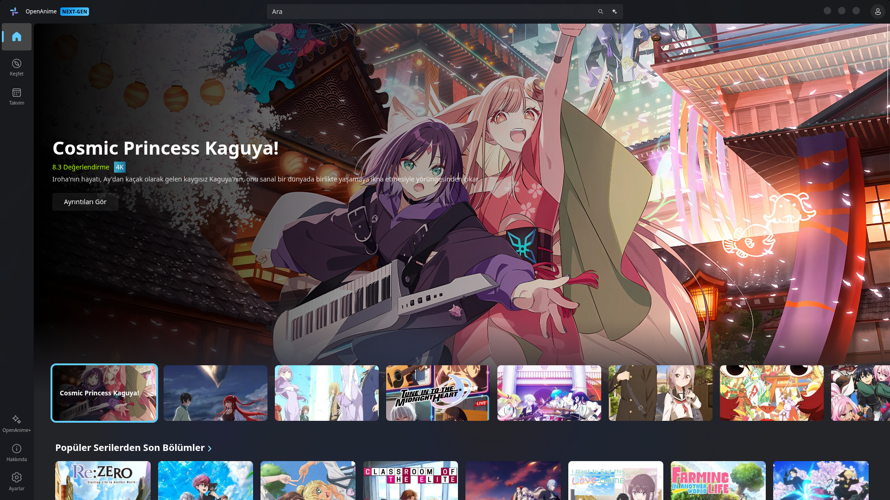
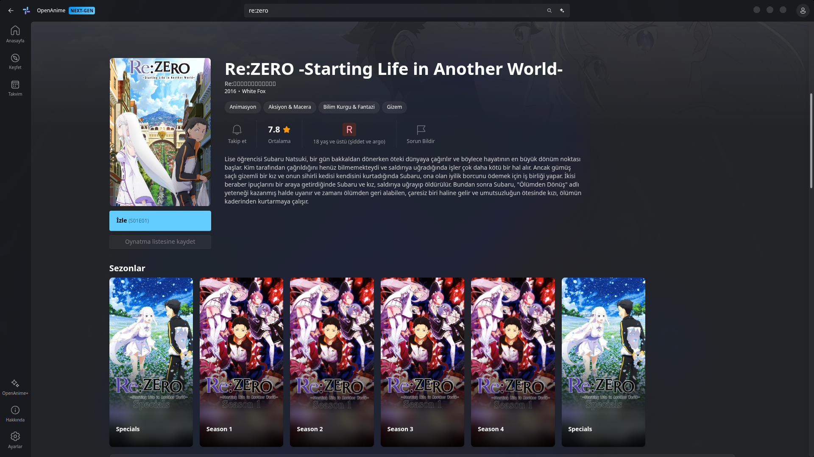
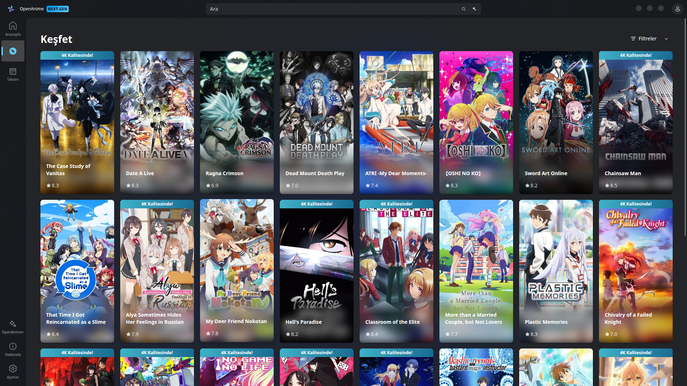
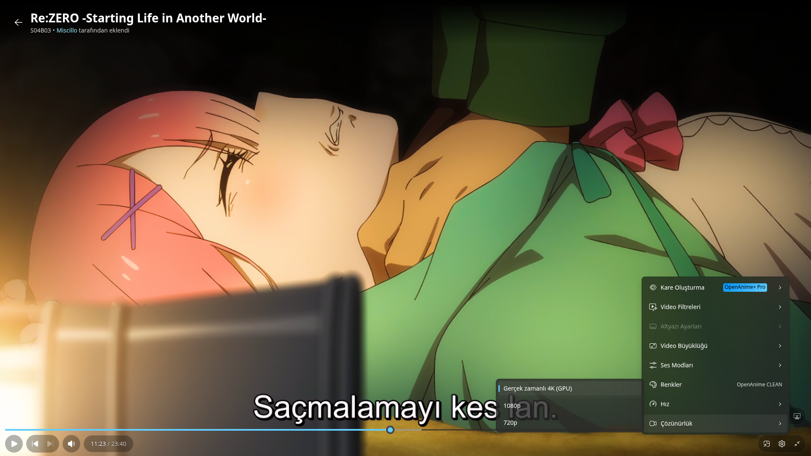

# OpenAnime Linux

[OpenAnime](https://openani.me) için yapılmış, unofficial Linux masaüstü uygulaması.

WebGPU ve Vulkan kullanarak 4K videoları kasma yapmadan oynatır. Native Wayland desteği var, yani modern sistemlerde (Hyprland, KDE 6 vs.) sorunsuz çalışıyor.

### Sürüm 1.0.9 Yenilikleri
- **Gelişmiş Yapılandırma:** `config.json` dosyası artık daha düzenli ve stabil.
- **Yüksek Performans Modu:** Hibrit ekran kartlı sistemler veya eski bilgisayarlar için dGPU kullanımını açıp kapatan `highPerformance` seçeneği eklendi.
- **Otomatik Yapılandırma Oluşturma:** Eğer `config.json` dosyası yoksa, uygulama artık tüm ayarları ve açıklamaları içeren bir dosyayı otomatik olarak oluşturuyor.
- **Hız ve Optimizasyon:** Ayarların yüklenme süreci optimize edildi ve genel kod yapısı iyileştirildi.


## Özellikler

*   **Performans:** WebGPU/Vulkan sayesinde 4K oynatma.
*   **Arayüz:** Pencere kenarlığı yok (Frameless). Kontroller sadece fareyi götürünce çıkıyor.
*   **Portable:** Kurulum derdi yok. İndir çalıştır.

## Kurulum

<details>
<summary><strong>Seçenek 1: AppImage (Önerilen)</strong></summary>

1.  [Releases](../../releases) sayfasından `.AppImage` dosyasını indirin.
2.  Dosyayı çalıştırılabilir yapın (örn: `OpenAnime-1.0.9.AppImage`).
3.  Çalıştırın!

**Sistem Entegrasyonu (Masaüstü Kısayolu & İkon)**:
```bash
chmod +x install.sh
./install.sh
```

**Kaldırma**:
```bash
chmod +x uninstall.sh
./uninstall.sh
```
</details>

<details>
<summary><strong>Seçenek 2: AUR (Arch Linux)</strong></summary>

```bash
yay -S openanime-bin
```
</details>

<details>
<summary><strong>Seçenek 3: Flatpak (Yakında)</strong></summary>

```bash
flatpak install flathub io.github.tuanapi.OpenAnime
```
</details>

## Ekran Görüntüleri

| Ana Sayfa | Detay Görünümü |
| :---: | :---: |
|  |  |
| **Keşfet** | **Oynatıcı** |
|  |  |

## Kaynaktan Derleme

Gereksinimler: `node`, `npm`.

```bash
git clone https://github.com/tuanapi/OpenAnime-Linux-Desktop-App.git
cd OpenAnime-Linux-Desktop-App
npm install
npm start          # Geliştirici modu
```
```bash
npm run dist       # AppImage oluştur (dist/ klasörüne)
```

## Yapılandırma (config.json)

Uygulama ayarlarını `~/.config/openanime/config.json` dosyasından manuel olarak düzenleyebilirsiniz. Mevcut tüm seçenekler şunlardır:

| Seçenek | Varsayılan | Açıklama |
| :--- | :--- | :--- |
| `highPerformance` | `true` | Hibrit ekran kartlı sistemlerde (NVIDIA/AMD) dGPU kullanımını zorlar. Eski PC'lerde kapatılabilir. |
| `discordRPC` | `true` | Discord'da "ne izliyor" durumunu gösterir. |
| `useCustomFrame` | `false` | Uygulamanın kendi pencere butonlarını (MacOS stili) aktif eder. |
| `persistFullscreen` | `false` | Bölüm geçişlerinde tam ekrandan çıkmamayı sağlar. |
| `isMaximized` | `false` | Uygulamanın tam ekranda başlayıp başlamayacağını belirler. |
| `titlebar` | `{...}` | Özel pencere butonlarının konum ve boyut ayarları. |

## Test Edilen Ortam

*   **OS**: Arch Linux (Kernel 6.19.12-arch1-1) 
*   **DE**: KDE Plasma 6.6.4 (Wayland)
*   **GPU**: NVIDIA GeForce RTX 5070 Ti (Driver 595.58.03) - *1.0.9 sürümü hibrit (dGPU) ortamında bizzat test edilip doğrulanmıştır.*

## Topluluk
Tartışmalara katılmak için [OpenAnime Discord](https://discord.gg/openanime) sunucusuna katılabilirsiniz.
