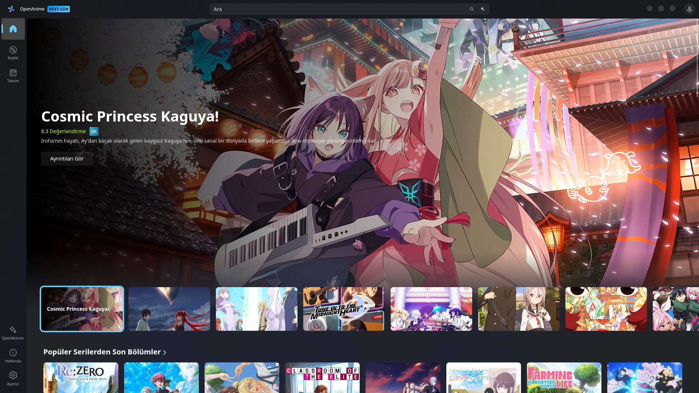
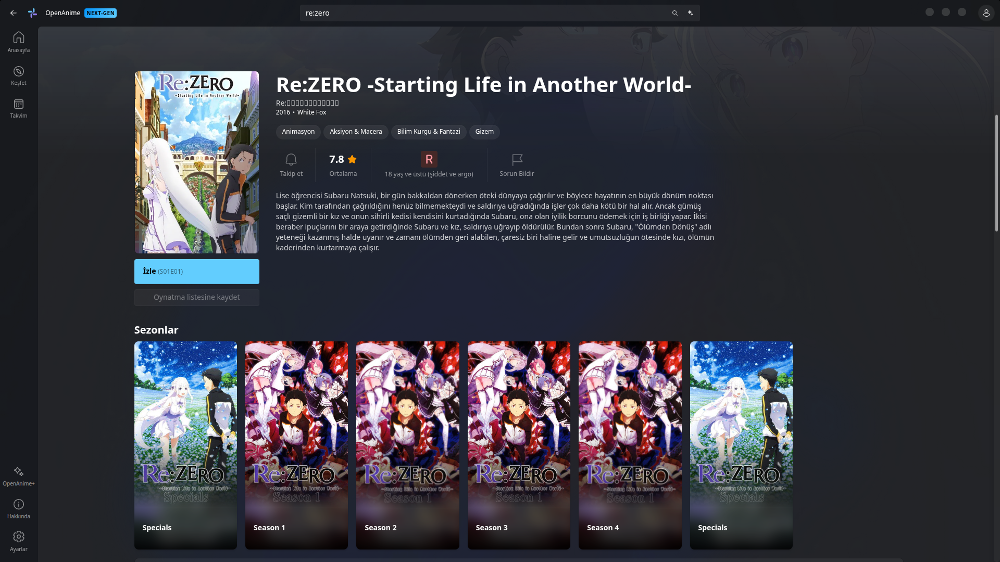
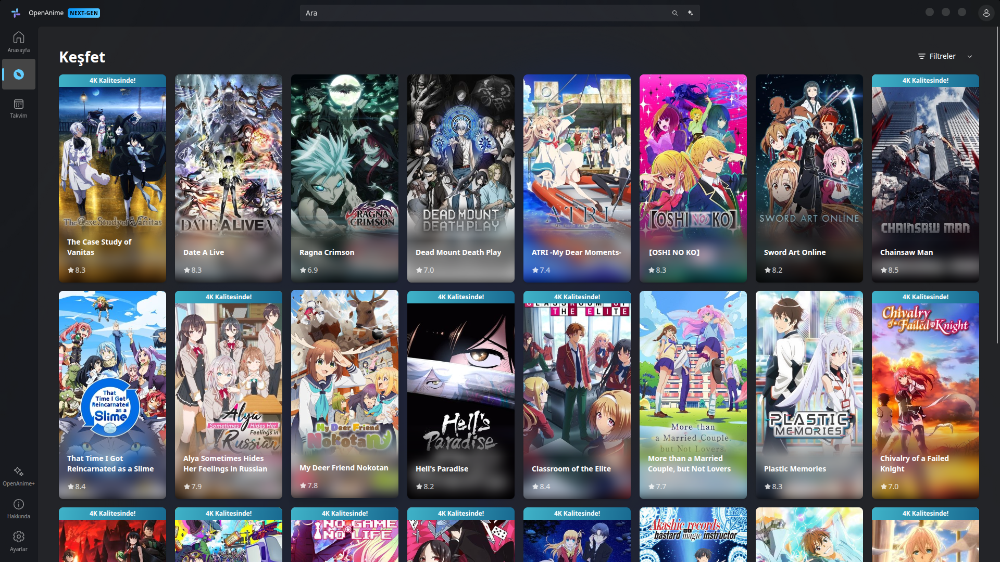
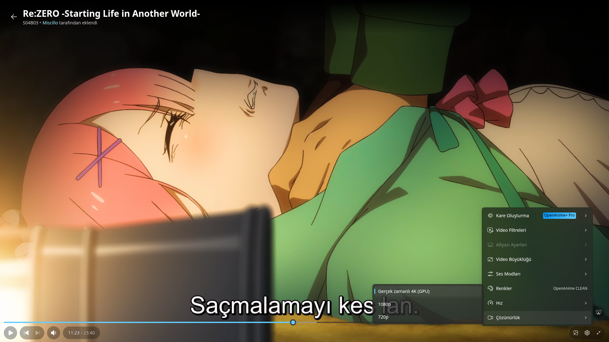

<div align="center">
  

  # OpenAnime Linux

  OpenAnime için gayriresmi Linux masaüstü istemcisi — WebGPU etkin, çerçevesiz pencere.

  [](https://github.com/tuanapi/OpenAnime-Linux)
  [](LICENSE)
  [](https://github.com/tuanapi/OpenAnime-Linux/releases)
  [](https://github.com/tuanapi/OpenAnime-Linux/releases/latest)
</div>

---

## Özellikler

- **Performans** – WebGPU, `forceWebGPU` açıkken sitenin tercihi ezilerek etkin
  tutulur.
- **Arayüz** – Özelleştirilebilir pencere kenarlığı.
- **Uygulama içi ayarlar** – Discord RPC ve pencere ayarları, sitenin kendi `/settings`
  sayfasındaki kartlar içinden yönetilir.
- **Taşınabilir** – Kurulum gerekmez, indir çalıştır.

---

## Sürüm 1.1.8

### Yeni

**Uygulama içi ayar kartları.** Discord RPC ve Pencere ayarları artık sitenin kendi
`/settings` sayfasında, sitenin gerçek Expander bileşenine bağlanan iki kart olarak
görünür. Kartlar yerel site kartlarıyla aynı şekilde açılır, animasyonu ve klavye
davranışıdır.

- **Discord RPC** – aç/kapa, **RPC Görünürlüğü** (`Herşey` / `İzlenen`), **Zaman Aşımı**
  (1–60 dk).
- **Pencere** – **Özel Pencere Çerçevesi**, **Tam Ekranı Koru**, **Açılışta Pencereyi Büyüt**.

**Discord oynatıyor rozetleri.** Oynatıyor / duraklatıldı durumları kendi ikonlarını kullanır.

**Zaman aşımı ayarı.** `pauseDropMinutes` ile duraklatıldıktan kaç dakika sonra Discord
durumunun temizleneceği belirlenebilir.

**Hata sayfası.** Sayfa üç kez yüklenemezse boş pencere yerine ne olduğunu söyleyen
bir hata sayfası gösterilir.

### Düzeltilenler

- **Ağ kontrolü yanlış adrese gidiyordu.** "İnternet var mı" testi `1.1.1.1:443`
  (Cloudflare) ile kuruluyordu; o adres engellendiğinde test başarısız dönüyor ve
  eski sayfayı yenileme hiç çalışmıyordu. Artık `openani.me` kullanılıyor.
- **Kayıtlı pencere konumu geçersiz kalınca uygulama görünmez açılıyordu.**
  Monitörü değiştirince ya da çözünürlüğü oynatınca eski konum olduğu gibi
  kullanılıyordu. Konum ve boyut artık bağlı bulunduğu ekrana sığdırılıyor;
  sığmıyorsa pencere ortalanıyor.
- **Pencereler sandbox'sız çalışıyordu.** Ana ve alt pencere artık `sandbox: true`
  ile açılıyor.
- **`get-config` config.json'daki her anahtarı renderer'a veriyordu.** Okuma
  listesiyle sınırlandı.
- **WebGPU tercihi her açılışta yeniden yazılıyordu.** `settings.useWebGPU`
  koşulu sorulmadan, her açılışta üzerine yazılıyordu. Artık yalnızca
  gerçekten farklıysa yazılır; `forceWebGPU` `false` ise hiç dokunulmaz.
- **config.json yazımı atomik değildi.** Yazma sırasında bir çökme dosyayı
  kırpıyordu. Artık `config.json.tmp` üzerine yazılıp `rename` ile yerine
  konuyor, kapanışta da boşaltılıyor.
- **X11'e geçişte ebeveyn süreç uygulama boyunca yanıp duruyordu.** Artık 3
  saniyelik el sıkışmanın ardından çıkıyor.
- **Paket bağımlılıklarında `libxkbcommon` eksikti.** Electron bu kütüphaneyi
  doğrudan bağlıyor; `deb` / `rpm` / `pacman` ve kaynak AUR paketinde bağımlılık
  olarak tanımlı değildi. `-bin` AUR paketinde `libxkbfile` ve `libxtst` de
  eksikti. Üçü de artık tüm paketlerde tanımlı.

---

## Kurulum

### AppImage (tüm dağıtımlar)
```bash
chmod +x OpenAnime-*.AppImage
./OpenAnime-*.AppImage
```
İsteğe bağlı: `./packaging/install.sh` ile masaüstü entegrasyonu.

### Arch Linux (AUR)
```bash
yay -S openanime-bin     # hazır binary
# veya kaynaktan derle:
yay -S openanime
```

### Debian / Ubuntu
```bash
sudo apt install ./openanime_*.deb
```

### Fedora / RHEL
```bash
sudo rpm -ivh openanime-*.rpm
```

### Nix / NixOS
```bash
nix run github:tuanapi/OpenAnime-Linux
# kalıcı kurulum:
nix profile install github:tuanapi/OpenAnime-Linux
```

---

## Kaynaktan Derleme

```bash
git clone https://github.com/tuanapi/OpenAnime-Linux.git
cd OpenAnime-Linux
npm install
npm start          # geliştirici modu
npm run dist       # paketleri oluştur (AppImage, deb, rpm, pacman, tar.gz)
```

---

## Yapılandırma

Discord RPC ve pencere ayarları uygulama içinden, sitenin `/settings` sayfasındaki
kartlardan yönetilir. Aşağıdaki dosya elle düzenleme veya geri yükleme içindir.

`~/.config/openanime/config.json`

| Seçenek | Varsayılan | Açıklama |
| :--- | :--- | :--- |
| `highPerformance` | `true` | Hibrit sistemlerde ayrık GPU kullan. `false` yapılırsa PRIME/DRI_PRIME devre dışı kalır (güç tasarrufu). |
| `discordRPC` | `true` | Discord'da "izliyor" durumunu göster. |
| `rpcVisibility` | `"all"` | `all` = her durumda göster. `watch_only` = yalnızca video oynatılırken göster. |
| `pauseDropMinutes` | `5` | Video duraklatıldıktan kaç dakika sonra Discord durumu temizlensin. |
| `useCustomFrame` | `false` | Electron'un Window Controls Overlay'ini kullan. |
| `persistFullscreen` | `false` | Bölüm geçişlerinde tam ekranda kal. |
| `isMaximized` | `false` | Son açılışta pencere maksimize miydi. |
| `bounds` | `{...}` | Son pencere konumu ve boyutu. Konum ekranın dışındaysa yeniden ortalanır. |
| `forceWebGPU` | `true` | `true` ise sitenin WebGPU tercihi ezilir; `false` ise hiç dokunulmaz. |
| `forcePrimeOffload` | `false` | AMD/Intel hibrit sistemlerde DRI_PRIME'ı zorla. |
| `gpuDisplayOverride` | `null` | GPU algılamasını elle ez: `"integrated"` veya `"discrete"`. |
| `debugOutlines` | `false` | Tıklanabilir elemanların etrafına kırmızı çerçeve çiz. |
| `titlebar` | `{...}` | Özel başlık çubuğu görünümü. |

---

## GPU Desteği (WebGPU)

Uygulama, hangi GPU'nun görüntüyü çizdiğini otomatik algılar ve her topolojide
WebGPU'yu ayrık GPU'ya taşır. Algılamayı doğrulamak için:

```bash
OpenAnime --diagnose    # paketli sürüm
npm run diagnose        # kaynak sürüm
```

Çıktıda `webgpu adapter` satırı hangi GPU'nun WebGPU'yu çalıştırdığını, `webgpu fps (load)`
satırı gerçek oynatma tarzı yük altındaki kare hızını gösterir. Sorun bildirirken
`DIAG_JSON=...` satırını issue'ya yapıştırın.

| Topoloji | Yapılan | Neden |
| :--- | :--- | :--- |
| Tek GPU (Intel / AMD / NVIDIA) | Hiçbir şey değiştirilmez | Varsayılan zaten doğru GPU'yu kullanır. |
| Çift GPU, ekran ayrık GPU'da (NVIDIA veya AMD) | Ayrık GPU'ya yönlendirme (NVIDIA: PRIME + Vulkan sabitleme; AMD/Intel: `DRI_PRIME=1`), native oturum | Ekran zaten güçlü GPU'da; video + WebGPU tek cihazda. |
| Çift GPU, ekran iGPU'da + NVIDIA ayrık | Otomatik X11'e geçiş (XWayland) + GLX offload | Wayland'de arabellek (iGPU) ile Vulkan (NVIDIA) iki sürücüye bölünüp video oynatırken çöker; X11'de her şey tek cihazda. |
| Çift GPU, ekran iGPU'da, NVIDIA yok (AMD/Intel) | `DRI_PRIME=1` (+ AMD'de gerekirse `RADV_DEBUG=nodcc`) | GL tabanlı yolları ayrık GPU'ya yöneltir. |
| Karışık (ekran hem iGPU hem ayrık GPU'da) | Ekranı süren GPU'ya göre yukarıdaki satırlardan biri otomatik seçilir | Seçim monitörün bağlı olduğu GPU'ya göre yapılır. |

Not: `force-high-performance-gpu`, Chromium'un WebGL, WebGPU ve kompozitör için
tek GPU seçmesini sağlar; `powerPreference` tarayıcıda yok sayılır.

Sorun bildirirken şunları ekleyin: `OpenAnime --diagnose` (veya `npm run diagnose`)
çıktısındaki `DIAG_JSON=...` satırı + `journalctl -k` içinde GPU sürücünüze ait
satırlar (`nvidia_drm`, `amdgpu` ya da `i915`):

```bash
journalctl -k | grep -iE 'nvidia_drm|amdgpu|i915' | tail -20
```

---

## Bilinen Sorunlar

- **Kare düşmesi / gecikme** – Önce `OpenAnime --diagnose` çalıştırıp `webgpu adapter`
  satırının doğru GPU'yu gösterdiğini doğrulayın. Hâlâ takılıyorsa `DIAG_JSON=...`
  satırını ve `journalctl -k` çıktısını
  [issue](https://github.com/tuanapi/OpenAnime-Linux/issues) olarak açın.

---

## Ekran Görüntüleri

| Ana Sayfa | Detay | Keşfet | Oynatıcı |
| :---: | :---: | :---: | :---: |
|  |  |  |  |

---

## Topluluk

Tartışmalar ve destek için [OpenAnime Discord](https://discord.gg/openanime) sunucusuna katılın.
Bir sorun ile karşılaşırsanız beni etiketleyebilirsiniz: **@tuanapi**
